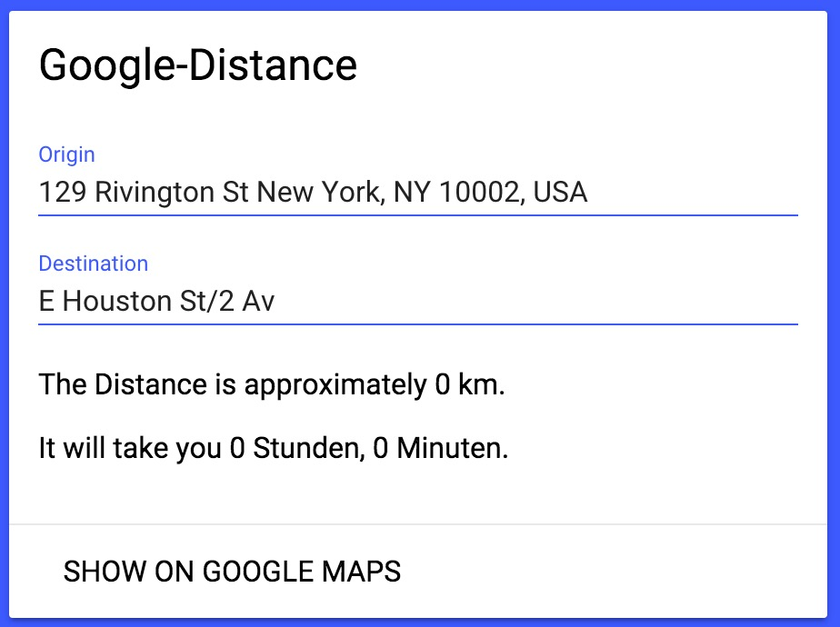

# google-distance
google-distance is a small Polymer-element written in Javascript that allows the user to input any address or location into the two textfields. It then sends a request to the google maps javascript api and displays the duration and distance inside the element. The developer needs to set the api-key as an attribute.

More documentation on the demo page

[Demo](http://leonardschuetz.ch/storage/stuff/polymer/google-distance/)

